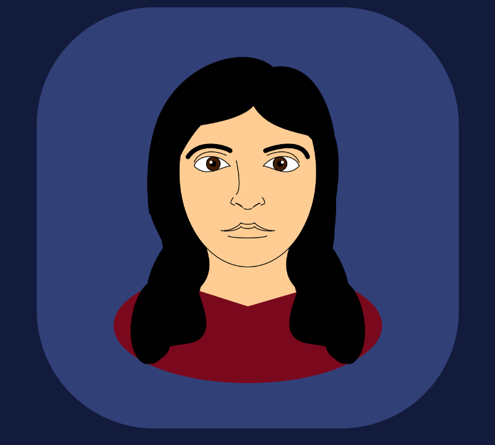

# CodeSelfPortraits
By Luis Sanchez
  
This assignment uses the p5.js library to draw a self-portrait. I utilized simple shapes and curves to draw it out.

[The portrait can be viewed directly here and is shown below.](https://xarts.usfca.edu/~Lfsanchez/CodeSelfPortraits/)

 
